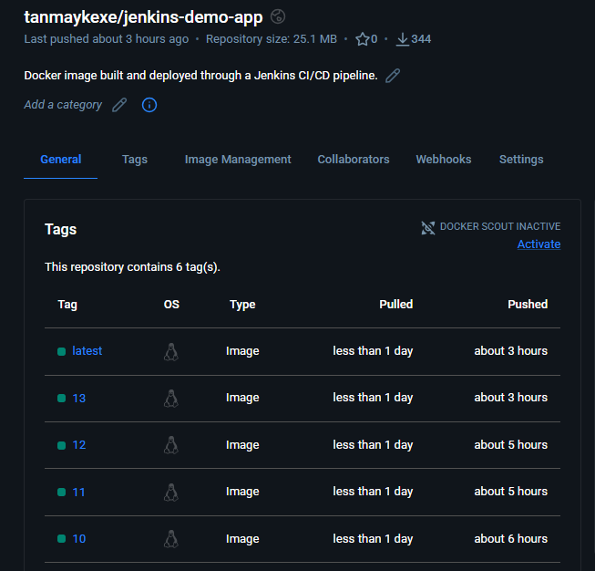
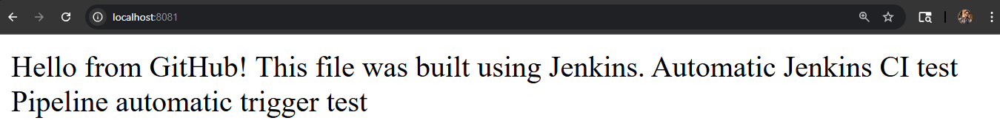

# 🚀 Jenkins CI/CD Pipeline with Docker

> Automated CI/CD pipeline using **Jenkins, GitHub, Docker and Docker Hub**, with automated testing, container deployment and post-deployment verification.

## 📌 Overview

This project demonstrates a complete CI/CD workflow where Jenkins automatically detects GitHub changes, builds and tests the application, creates a versioned Docker image, publishes it to Docker Hub, deploys the container and verifies the deployment.

```text
GitHub
   ↓
Jenkins SCM Polling
   ↓
Build → Test → Docker Build
   ↓
Docker Hub
   ↓
Deploy
   ↓
Verify Deployment
```

## 🛠️ Tech Stack

- **Jenkins** — CI/CD automation
- **Git & GitHub** — Source control
- **Docker** — Containerization
- **Docker Hub** — Image registry
- **Nginx** — Web server
- **Linux / WSL2** — Development environment
- **Bash** — Automation

## ⚙️ Pipeline Stages

| Stage | Description |
|---|---|
| **Build** | Reads and prepares application files |
| **Test** | Validates application file and expected content |
| **Docker Build** | Builds and versions the Docker image |
| **Docker Push** | Publishes image to Docker Hub |
| **Deploy** | Runs the new Docker container |
| **Verify** | Checks container status and HTTP response |

### Docker Image

Images are versioned using the Jenkins build number:

```text
tanmaykexe/jenkins-demo-app:<BUILD_NUMBER>
```

The pipeline also maintains the `latest` tag.

## 📂 Project Structure

```text
jenkins-demo/
├── Jenkinsfile
├── Dockerfile
├── app.txt
├── README.md
└── screenshots/
    ├── jenkins-pipeline-success.png
    ├── dockerhub-image.png
    └── deployment-verification.png
```

## 📸 Screenshots

### Jenkins Pipeline


### Docker Hub



### Deployed Application



## 🎯 Key Skills Demonstrated

`Jenkins` · `CI/CD` · `Git` · `GitHub` · `Docker` · `Docker Hub` · `Linux` · `Bash` · `Nginx` · `Pipeline as Code`

## 🚀 Future Improvements

- Jenkins Agents
- GitHub Webhooks
- Kubernetes Deployment
- Helm
- AWS Deployment
- Monitoring & Observability

---

### 👨‍💻 Author

**Tanmay Khatri**

BCA Graduate | DevOps / Cloud Enthusiast
