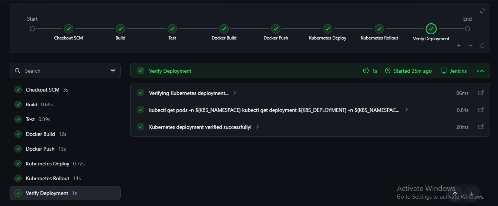
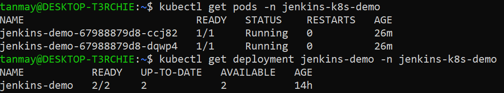
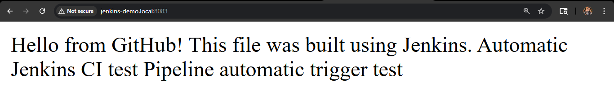

# 🚀 Jenkins CI/CD Pipeline with Kubernetes

> Automated CI/CD pipeline using Jenkins, GitHub, Docker, Docker Hub and Kubernetes, with automated testing, container publishing, rolling deployment and Ingress-based application access.

## 📌 Overview

This project demonstrates a complete CI/CD workflow where Jenkins automatically detects GitHub changes, builds and tests the application, creates a versioned Docker image, pushes it to Docker Hub and deploys it to Kubernetes.

GitHub
   ↓
Jenkins
   ↓
Build → Test → Docker Build
   ↓
Docker Hub
   ↓
Kubernetes Deployment
   ↓
Rolling Update
   ↓
Service → Ingress
   ↓
Application

## 🛠️ Tech Stack

- Jenkins — CI/CD automation
- Git & GitHub — Source control
- Docker — Containerization
- Docker Hub — Image registry
- Kubernetes — Container orchestration
- Ingress-NGINX — HTTP routing
- Nginx — Web server
- Linux / WSL2 — Development environment
- Bash — Automation

## ⚙️ Pipeline Stages

| Stage | Description |
|---|---|
| Build | Prepares application files |
| Test | Validates application content |
| Docker Build | Builds a versioned Docker image |
| Docker Push | Publishes image to Docker Hub |
| Kubernetes Deploy | Updates the Kubernetes Deployment |
| Kubernetes Rollout | Waits for the rolling update |
| Verify Deployment | Verifies Pods and Deployment status |

## ☸️ Kubernetes

- Deployment with 2 replicas
- ClusterIP Service
- Ingress resource with host-based routing
- Automated rolling updates using Jenkins

### Docker Image

Images are versioned using the Jenkins build number:

tanmaykexe/jenkins-demo-app:<BUILD_NUMBER>

## 📂 Project Structure

jenkins-kubernetes-cicd/
├── Jenkinsfile
├── Dockerfile
├── app.txt
├── k8s-deployment.yaml
├── k8s-service.yaml
├── k8s-ingress.yaml
└── README.md

## 📸 Screenshots

### Jenkins Pipeline

### Kubernetes Deployment

### Application Through Ingress

## 🎯 Key Skills Demonstrated

Jenkins · CI/CD · Git · GitHub · Docker · Docker Hub · Kubernetes · Ingress · Linux · Bash · Pipeline as Code

## 🚀 Future Improvements

- Jenkins Agents
- GitHub Webhooks
- Helm
- AWS EKS Deployment
- Monitoring & Observability

---

### 👨‍💻 Author

Tanmay Khatri

BCA Graduate | DevOps / Cloud Enthusiast
